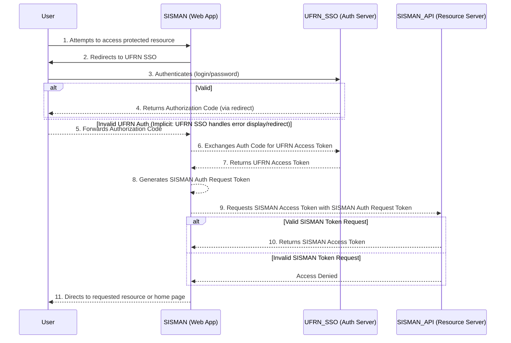
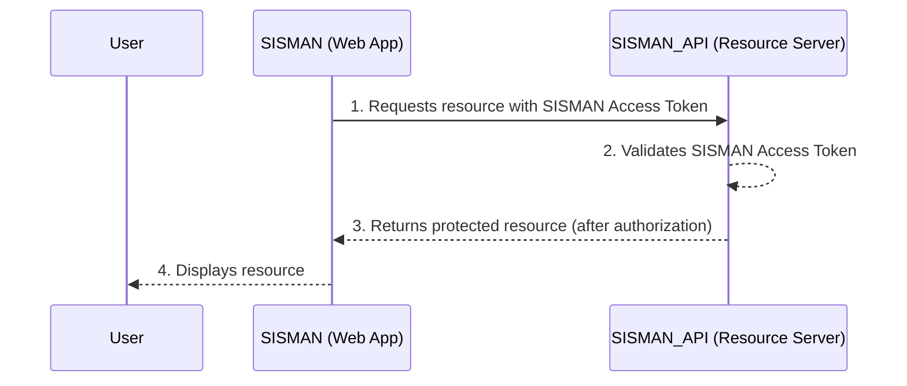
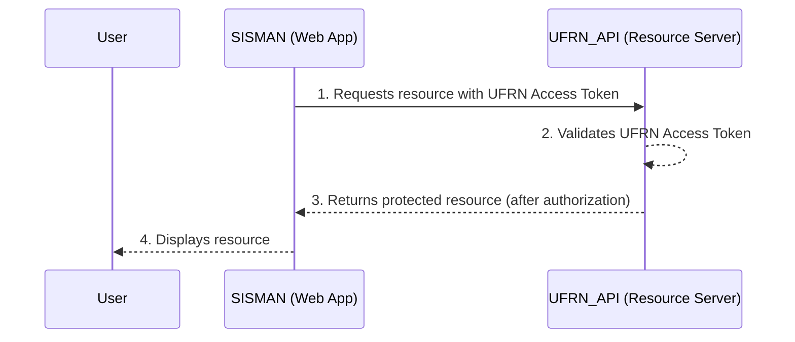
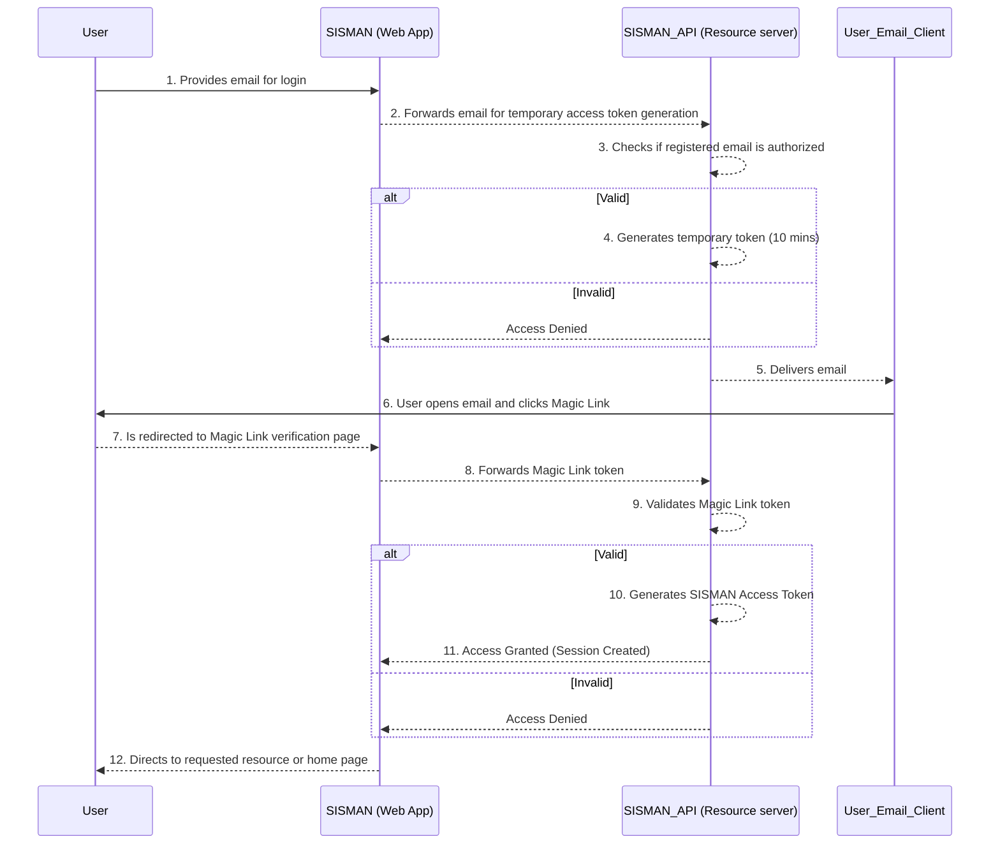
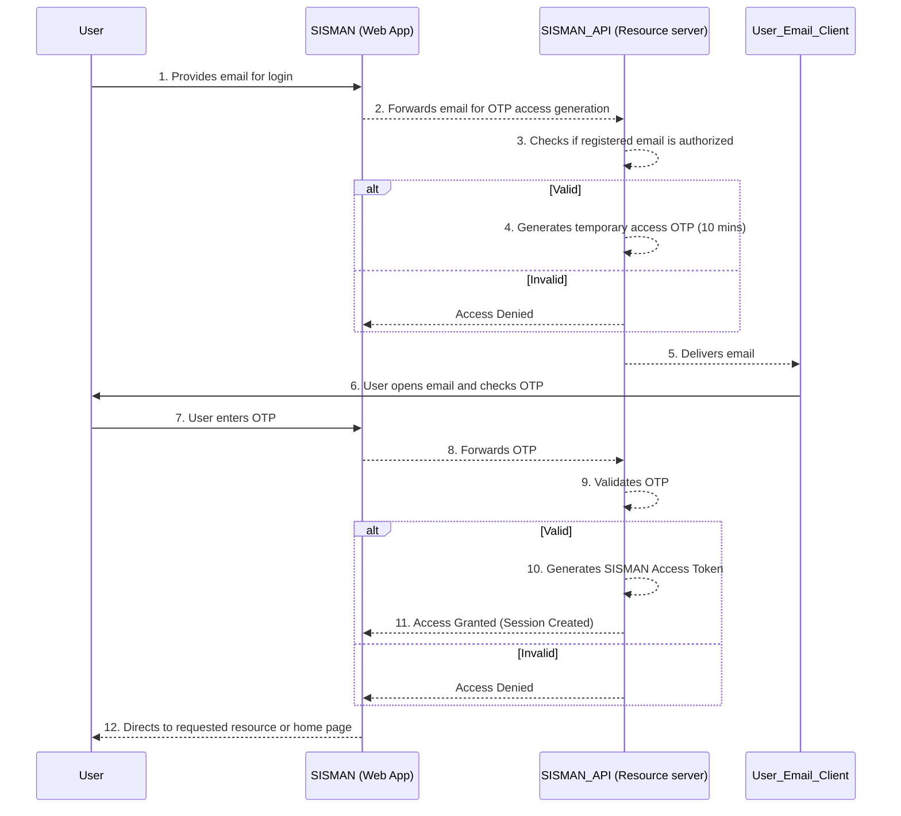

## SISMAN SECURITY LAYER AND AUTHENTICATION AND AUTHORIZATION FLOW

### 1. Introduction to the Security Layer, Authentication, and Authorization

The implementation of an adequate security layer is fundamental for the integrity, reliability, and usability of any web system, especially those that manage critical data and processes. This layer encompasses mechanisms and policies designed to protect stored information and resources against unauthorized read and/or write access and unavailability. Key aspects of this layer include the choice and definition of **authentication** processes – the act of verifying the identity of a user or service – and **authorization** – the act of granting or denying access permissions to specific resources after successful authentication.

The AAA (Authentication, Authorization, Accountability) approach is an essential pillar of information security. This model is based on three crucial components: Authentication, which confirms whether an entity (user, device, or system) is who it claims to be; Authorization, which defines what actions the authenticated entity can perform and which resources it can access; and Accountability, which allows tracking an entity's actions, unequivocally associating them with its identity, which is fundamental for non-repudiation, ensuring that an action performed cannot be denied by its author.

### 2. Non-Storage of Passwords and Sensitive Information (NFR14)

In compliance with non-functional requirement NFR14, SISMAN adopts an important security policy: **not to store user passwords or other sensitive information directly in its databases**. This strategic decision delegates the primary responsibility for identity verification to specialized identity providers, specifically, UFRN's Single Sign-On (SSO) system, <https://autenticacao.info.ufrn.br/sso-server/login>, or uses passwordless authentication mechanisms.

Some of the benefits of this approach are summarized below:

*   **Enhanced Security:** Reduces the risk associated with data breaches. If SISMAN does not store passwords, they cannot be compromised in the event of a system security breach. It eliminates vulnerability to attacks targeting password databases, such as *rainbow table attacks* or *brute-force* on password *hashes*.
*   **Reduced Attack Surface:** Simplifies SISMAN's security architecture by concentrating credential management in specialized and robust systems.
*   **Compliance with Best Practices:** Aligns SISMAN with modern security practices that discourage local storage of sensitive credentials.
*   **Improved User Experience (with SSO):** Allows users from the UFRN community to use their existing institutional credentials, simplifying access.
*   **Reduced Support Costs:** Decreases the volume of password reset requests and issues related to user password management.

### 3. Definition of Authentication and Authorization Flows

An **authentication flow** refers to the sequence of steps and protocols that a system or application follows to verify the identity of a client (whether a human user, device, or another system) attempting to access its resources. After successful authentication, the **authorization flow** comes into play, comprising the procedures to determine and grant appropriate permissions to that authenticated client, defining which resources it can access and what operations it can perform.

There are various authentication and authorization flows and protocols, each with its characteristics, use cases, and security levels. Among the best known are:

*   **OAuth 2.0 (RFC 6749):** A widely adopted authorization framework that allows third-party applications to obtain limited access to resources of an HTTP service, either on behalf of the resource owner or on their own. It defines several "grant types," such as the *Authorization Code Grant*.
*   **Magic Link:** A passwordless authentication method where the user enters their email, and the system sends a unique, time-sensitive link to that address. Clicking the link authenticates the user.
*   **OTP (One-Time Password):** Another passwordless method where the system generates a short-lived numeric or alphanumeric code, sent to the user (usually via email, SMS, or an authenticator app). The user enters this code to authenticate.

### 4. Access Flows Defined for SISMAN

For access to SISMAN, the following authentication and authorization flows have been defined, aiming to balance security, usability, and flexibility:

1.  **Authorization Code Grant (OAuth 2.0):** The primary flow, used mainly for users from the UFRN academic community, integrating with the institution's Single Sign-On (SSO) system.
2.  **Combination of Magic Link and OTP:** Used as an alternative in case of UFRN SSO unavailability, or for users external to the academic community who do not have SIG/SSO credentials.

### 5. Authorization Code Flow

The "Authorization Code Grant" flow is one of the most secure and common in the OAuth 2.0 framework, ideal for traditional web applications where server-side logic can protect client secrets.

**Actors Involved:**

*   **Resource Owner (User):** The entity (usually a human user) that owns the protected resources and grants permission for an application to access these resources on their behalf.
*   **Client (SISMAN - Web Application):** The application that wishes to access protected resources on behalf of the Resource Owner.
*   **Authentication Server (UFRN SSO):** The server that authenticates the Resource Owner, manages authorization grants, and issues UFRN Access Tokens.
*   **Authentication/Authorization/Resource Server (SISMAN API):** The server that can authenticate the Resource Owner (for passwordless authentication cases), manages authorization grants, issues SISMAN Access Tokens, hosts protected resources, and accepts valid SISMAN Access Tokens to grant access.

**Detailed Flow:**

1.  **Access Request (User to SISMAN):** The user attempts to access a protected area of SISMAN.
2.  **Redirection to Authorization Server (SISMAN to UFRN SSO):** SISMAN (Web Application) redirects the user's browser to the Authorization Server (UFRN SSO), including parameters such as `client_id`, `redirect_uri`, `response_type=code`, and `scope` (scope of requested permissions).
3.  **User Authentication (User with UFRN SSO):** The user authenticates directly with UFRN SSO using their institutional credentials. SISMAN does not have access to these credentials.
4.  **Authorization Grant and Code Issuance (UFRN SSO to SISMAN via User):** After successful authentication (and, optionally, user consent), UFRN SSO redirects the user's browser back to SISMAN's `redirect_uri`, providing a temporary `Authorization Code`.
5.  **Code Exchange for Tokens (SISMAN to UFRN SSO - *Back-channel*):** SISMAN (Web Application), in a *back-channel* communication (server-to-server, not visible to the user), exchanges the received `Authorization Code` for an `Access Token` (and, optionally, a `Refresh Token`) with the Authorization Server (UFRN SSO). This request includes the `Authorization Code`, `client_id`, `client_secret`, and `redirect_uri`.
6.  **Obtaining UFRN Access Token (SISMAN to UFRN SSO - *Back-channel*):** SISMAN (Web Application), in a *back-channel* communication (server-to-server, not visible to the user), exchanges the received `Authorization Code` for a `UFRN Access Token` (and, optionally, a `Refresh Token`) with the Authorization Server (UFRN SSO). This request includes the `Authorization Code`, `client_id`, `client_secret`, and `redirect_uri`.
7.  **Generation of SISMAN Authorization Request Token (SISMAN):** With the `UFRN Access Token` in hand, SISMAN (Web Application) generates an internal token (`SISMAN Authorization Request Token`) that will be used to request a `SISMAN Access Token` from the SISMAN API. This token may contain relevant information obtained from UFRN SSO (id, login, email, etc.).
8.  **Request for SISMAN Access Token (SISMAN to SISMAN API):** SISMAN (Web Application) sends the `SISMAN Authorization Request Token` to a specific endpoint in the SISMAN API (Resource Server) to obtain a `SISMAN Access Token`.
9.  **Validation and Issuance of SISMAN Access Token (SISMAN API):** The SISMAN API validates the `SISMAN Authorization Request Token`. If valid, the SISMAN API generates and returns a `SISMAN Access Token` to SISMAN (Web Application). This SISMAN token will contain the user's authorization information (profiles, permissions) within the SISMAN context.
10. **Accessing Protected SISMAN Resources (SISMAN to SISMAN API):** SISMAN (Web Application) uses the obtained `SISMAN Access Token` to make requests to the SISMAN API (Resource Server) on behalf of the user. The token is sent in the `Authorization` header of the HTTP request (e.g., `Authorization: Bearer <sisman_access_token>`).
11. **SISMAN Token Validation and Authorization (SISMAN API):** The SISMAN API validates the `SISMAN Access Token` (verifying its signature, validity, and the permissions associated with the user, based on profiles such as Administrator, Supervisor, etc., according to NFR15) and grants or denies access to the requested resource.

**Schematic Diagram of the Authorization Code Flow:**

In this model, **authentication** is the responsibility of UFRN SSO, while **authorization** (defining what the user can do after being authenticated) is managed by the SISMAN API, based on configured profiles and permissions.

Thus, considering that the SISMAN system queries both the SISMAN_API and an external UFRN API (conveniently named UFRN_API), the query flows after obtaining the access tokens (SISMAN and UFRN) are represented in the diagrams below:

**Schematic Diagram of Resource Access Flow - SISMAN API:**

**Schematic Diagram of Resource Access Flow - UFRN API:**

### 6. Magic Link and OTP Flow

Both Magic Link and OTP (One-Time Password) offer a robust passwordless authentication method, particularly useful for contingency scenarios or for users who do not have SSO credentials. It is important to note that authentication through this flow may impact some SISMAN functionalities, as information requiring dynamic queries (consulting the UFRN_API) will not be available, for obvious reasons (this access flow does not grant the UFRN Access Token).

**Usage Conditions:**

*   Temporary unavailability of UFRN SSO.
*   Users from the academic community who have already performed an initial login via SSO (thus being previously registered or recognized by SISMAN).
*   Users external to the academic community (e.g., suppliers, third parties, other collaborators) who have been previously registered by a SISMAN administrator.

**Detailed Magic Link Flow (as per diagram):**

1.  **Login Request (User to SISMAN):** The user accesses the SISMAN interface (Web Application) and provides their email address to start the Magic Link login process.
2.  **Email Forwarding (SISMAN Web Application to SISMAN API):** The SISMAN web application forwards the provided email to the SISMAN API (Resource server), requesting the generation of a temporary access token for the Magic Link.
3.  **Email Verification (SISMAN API):** The SISMAN API internally verifies if the provided email is registered and authorized to use this login method.
4.  **Temporary Token Generation (SISMAN API):** If the email is considered valid and authorized, the SISMAN API generates a unique temporary token for the Magic Link, with a defined validity period (e.g., 10 minutes). Otherwise, the process may be interrupted and access denied (as indicated in the diagram by the "Invalid" alternative after email verification).
5.  **Email with Magic Link Sent (SISMAN API to User's Email Client):** The SISMAN API sends an email to the user's address. This email contains the Magic Link, which embeds the generated temporary token.
6.  **User Interaction with Email (User):** The user receives and opens the email in their email client and clicks on the Magic Link.
7.  **Redirection for Verification (User to SISMAN Web Application):** Upon clicking the Magic Link, the user's browser is redirected to a specific verification page in the SISMAN web application, passing the link's token as a URL parameter.
8.  **Token Forwarding (SISMAN Web Application to SISMAN API):** The SISMAN web application extracts the Magic Link token from the URL and forwards it to the SISMAN API for validation.
9.  **Magic Link Token Validation (SISMAN API):** The SISMAN API validates the received token, checking its authenticity, whether it has expired, and if it corresponds to a valid request associated with the user's email.
10. **SISMAN Access Token Generation (SISMAN API):** If the Magic Link token is successfully validated, the SISMAN API generates a `SISMAN Access Token` to authenticate the user's session in the system.
11. **Access Grant (SISMAN API to SISMAN Web Application):** The SISMAN API informs the SISMAN web application that access has been granted and a user session is created, returning the `SISMAN Access Token`.
12. **User Redirection (SISMAN Web Application to User):** The SISMAN web application redirects the user, now authenticated, to the resource they were originally trying to access or to the system's home page.

**Schematic Diagram of the Magic Link Flow:**

**Schematic Diagram of OTP Flow:**

### 7. Configuration

This chapter details the technical configurations implemented in the SISMAN front-end to enable the previously described authentication and authorization flows, focusing on the necessary integrations for access via UFRN SSO and passwordless methods (Magic Link and OTP).

#### 7.1 Configuration for UFRN SSO Access

1.  **Obtaining Access Credentials from UFRN:** The access keys required for integration with UFRN's Single Sign-On (SSO) system were formally requested and granted by the institution through the Bifrost portal (<https://bifrost.ufrn.br/>). During the request process, the application was registered with the following specifications:
    *   **Application Name:** SISMAN - Physical Facilities Maintenance System.
    *   **Description:** Pilot system developed by the Directorate of Maintenance and Facilities (DIMAN/INFRA), accessible at <https://sisman.infra.ufrn.br/>, aiming to optimize maintenance services for UFRN's physical facilities, promoting greater sectoral efficiency and improving control over incident and service records.
    *   **Application Type:** WEB.
    *   **Environment:** Production.
    *   **Requested Services:** Permission scope for reading user data was requested, essential for the authentication process.

2.  **Adoption of the Auth.js Library (NextAuth.js):**
    Considering that SISMAN is developed on the Next.js framework, the Auth.js library (formerly NextAuth.js) was chosen to manage authentication aspects. Auth.js is a runtime-agnostic library, based on standard web APIs, that integrates with multiple modern JavaScript frameworks to provide a simplified, extensible, and secure authentication experience. Its flexibility allows integration with various identity providers.

3.  **Creation of a Custom Provider for UFRN SSO:**
    Despite the wide range of pre-configured providers available in Auth.js, the UFRN Single Sign-On (SSO) system is not listed as a native option. Thus, it became imperative to create a custom provider within the Auth.js configuration. This customization involved explicitly defining the interaction mechanisms with UFRN SSO's specific endpoints.

4.  **Manual Endpoint Configuration and Parameter Adaptation:**
    A significant challenge in integrating with UFRN SSO was the absence of a *well-known* endpoint (such as `/.well-known/openid-configuration`), which typically facilitates automatic discovery of OAuth 2.0/OpenID Connect identity provider metadata and endpoints. Consequently, the entire configuration of the custom provider for UFRN SSO had to be done manually, with explicit insertion of the following endpoints:
    *   Authorization endpoint (defined in `UFRN_AUTH_URL`).
    *   Endpoint for exchanging the authorization code for an access token (`UFRN_TOKEN_URL`).
    *   Endpoint for obtaining user information (`UFRN_USERINFO_URL`).
    Additionally, it was observed that the UFRN SSO implementation does not strictly follow all OAuth 2.0 protocol conventions. This required specific adaptations in the parameters sent and expected during the authentication flow to ensure correct interoperability between SISMAN (via Auth.js) and the UFRN identity provider.

5.  **Implementation of Authorization via SISMAN API:**
    UFRN SSO is solely responsible for user authentication, i.e., verifying their identity. After successful authentication, the definition of user access permissions (authorization) to different SISMAN modules and functionalities is delegated to the SISMAN API. It was necessary to implement logic so that, after SSO authentication, the front-end queries a specific endpoint in the SISMAN API (`AUTHORIZATION_API_URL`) to obtain and apply the relevant authorization rules for the user's profile.

#### 7.2 Configuration for Passwordless Access (Magic Link and OTP)

1.  **Custom Provider with Delegation to SISMAN API:**
    For passwordless authentication flows, including Magic Link and One-Time Password (OTP), a custom provider was also developed in Auth.js. Instead of using the default email adapter provided by the library itself (like the `EmailProvider` which handles sending and verification internally), it was decided to fully delegate to the SISMAN API the responsibility for generating, sending, and validating magic links and OTPs. This strategic decision aims to simplify front-end development by avoiding the additional complexity that would be introduced by needing to configure an email provider and manage a database for the token lifecycle directly in the presentation layer. The front-end provider acts as an intermediary, collecting the user's email and orchestrating communication with the API.

2.  **Manual Communication with SISMAN API:**
    This delegation necessitated manually implementing communication between the SISMAN front-end (via Auth.js's custom provider) and the specific SISMAN API endpoints responsible for passwordless authentication. The flow involves sending the user's email to the API, which then processes the request, sends the Magic Link or OTP to the user's email. Subsequently, when the user interacts with the link or enters the OTP, the front-end sends the link's token or OTP code back to the API for validation.

3.  **Creation of a Callback Page for Magic Link:**
    Specifically for the Magic Link flow, it was necessary to develop a dedicated callback endpoint in the SISMAN front-end. This page is the destination to which the user is redirected upon clicking the magic link received in their email. The callback page is responsible for extracting the unique token from the URL, initiating the token validation process with the SISMAN API, and, upon success, establishing the user's session.

#### 7.3 Environment Variables Used

The configuration of authentication and authorization flows, as well as secure communication between the different components (SISMAN front-end, SISMAN API, UFRN SSO), depends on a set of environment variables. These variables store sensitive information, endpoint URLs, and API keys, and must be properly configured in the SISMAN deployment environment. The main variables include:

*   **General Application and Auth.js:**
    *   `NEXTAUTH_URL`: Base URL of the Next.js application, used by Auth.js for callbacks and other functionalities.
    *   `NEXTAUTH_SECRET`: A secret used to sign session cookies and JWTs generated by Auth.js, ensuring their integrity and authenticity.
    *   `NEXTAUTH_SESSION_MAX_AGE`: Defines the maximum duration of a user session (in seconds).

*   **SISMAN API:**
    *   `SISMAN_API_URL`: Base URL of the main SISMAN API, for general system functionalities.
    *   `AUTHORIZATION_API_URL`: URL of the specific endpoint in the SISMAN API responsible for authorization logic and obtaining user profiles.
    *   `AUTHORIZATION_API_KEY`: API key to authenticate requests from the front-end to the SISMAN API's authorization endpoint.
    *   `AUTHORIZATION_JWT_SECRET`: Secret used in the SISMAN API to validate or sign JWTs related to authorization processes.

*   **Integration with UFRN SSO:**
    *   `UFRN_AUTH_BASE_URL`: Base URL for UFRN SSO authentication services. (Can be used to construct other URLs if not explicitly defined).
    *   `UFRN_CLIENT_ID`: The client identifier (Client ID) registered for the SISMAN application with the UFRN SSO provider.
    *   `UFRN_CLIENT_SECRET`: The client secret associated with the `UFRN_CLIENT_ID`, used in confidential flows.
    *   `UFRN_AUTH_URL`: Full URL of the UFRN SSO authorization endpoint.
    *   `UFRN_TOKEN_URL`: Full URL of the UFRN SSO token endpoint.
    *   `UFRN_USERINFO_URL`: Full URL of the UFRN SSO endpoint for obtaining authenticated user information.
    *   `UFRN_REDIRECT_URI`: The redirect URI configured in UFRN SSO to which the user is sent after authentication. Corresponds to the Auth.js callback route.
    *   `UFRN_API_URL`: Base URL for other UFRN APIs that may be consumed by SISMAN using the UFRN Access Token.
    *   `UFRN_XAPI_KEY`: A specific API key, required for access to certain UFRN SSO endpoints or services or related APIs.

The correct configuration and protection of these environment variables are fundamental for the secure, effective, and stable operation of the authentication and authorization mechanisms implemented in SISMAN.
